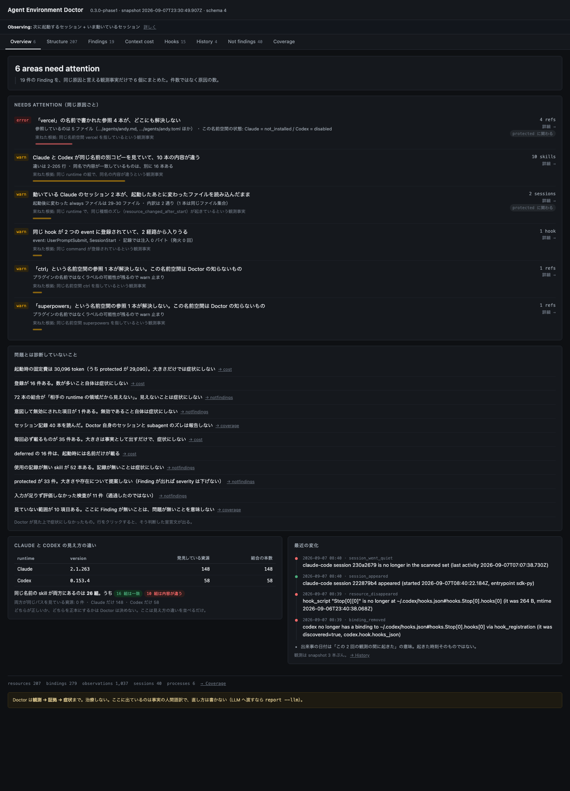
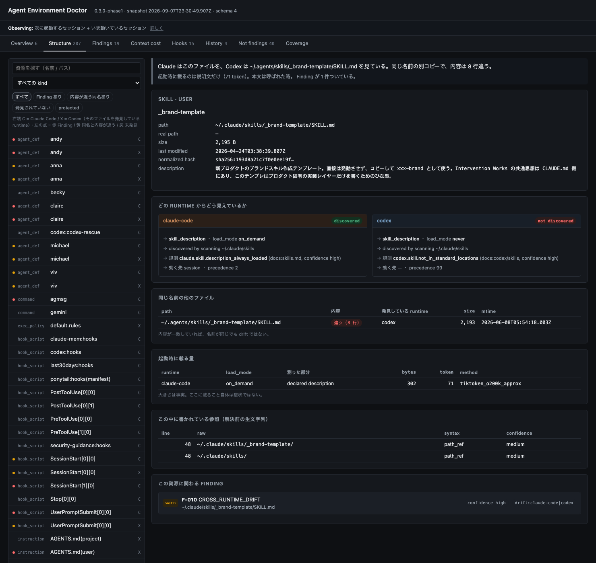
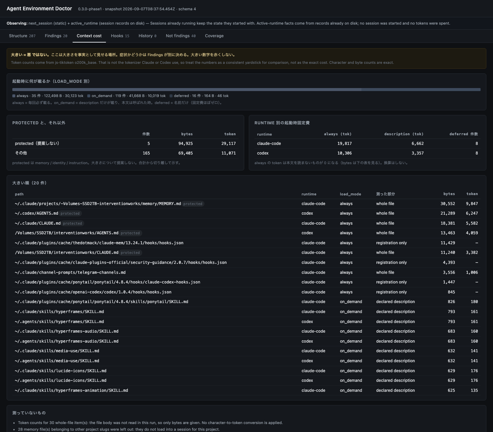
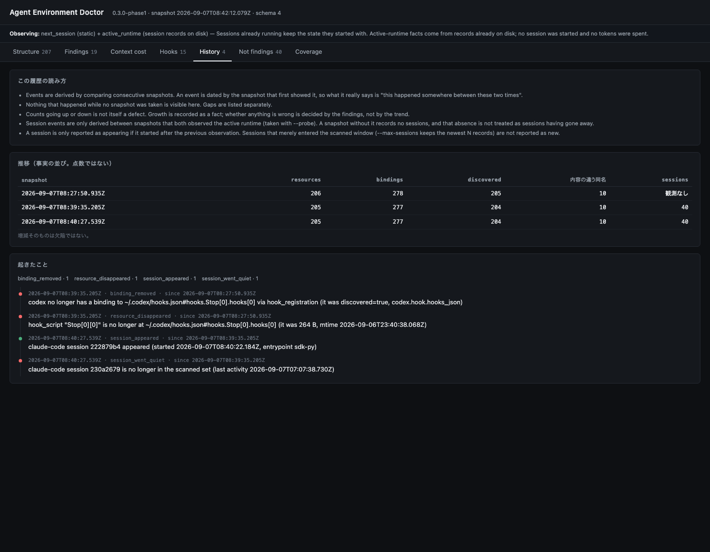

# v0.3 縦通し dogfood — 実環境を scan してブラウザで全貌を見る（2026-09-07）

対象は BECKY の実環境（Claude Code 2.1.263 + codex-cli 0.153.4、project `/Volumes/SSD2TB/interventionworks`）。
`--probe`（起動中セッションの記録）と `--launcher ~/bin/becky-start.sh` を付けた実測。

```bash
npm run ui -- --probe --self-session <このセッションの id> --launcher ~/bin/becky-start.sh --project /Volumes/SSD2TB/interventionworks
# → http://127.0.0.1:7333/   READ ONLY、127.0.0.1 のみ、GET 以外は 405
```

## 見えるようになったもの

| 画面 | 何が分かるか |
|---|---|
| **Overview** | **最初に開く画面。`N areas need attention` の N は Finding の件数ではなく、束ねたあとの原因の数**（この環境では 19 Finding → 6 areas）。症状の人間語要約・問題とは診断していないこと・Claude / Codex の差・最近の変化 |
| Structure | 資源 1 つを選ぶと、両 runtime からの見え方・結合の経路・同名との内容一致・起動時のコスト・参照・履歴・Finding と Evidence が 1 画面 |
| Findings | 5 種の症状。同じ原因は cluster にまとめ、人への問いは 1 つ。Evidence・confidence・unknown・Doctor が判断していないこと |
| Context cost | 起動時に何がどれだけ載るか。**大きい = 悪 にしない**。protected は合計から分離 |
| Hooks | 登録の一覧（event × command × 効く先）と、増幅として報告したもの / しなかったもの |
| History | いつ増えた / 消えた / drift した / セッションが古くなった。観測していない期間は明示 |
| Not findings | 数が大きいだけ / 使っていない / 見えない を症状にしないための一覧。protected 全量、評価しなかったもの |
| Coverage | 見ているもの / 見ていないもの、runtime、動いているセッション、起動中プロセス |

## 実測値（この環境）

| | 値 |
|---|---|
| resources / bindings / observations | 205 / 277 / 702（`--probe` 込み） |
| Finding | error 4 / warn 15 |
| 起動時固定費 | **約 30,123 token**（`always`）+ skill description **10,019 token** |
| うち protected | 29,117 token（MEMORY.md / CLAUDE.md / AGENTS.md） |
| deferred（MCP tool 等） | 16 件で 46 token（名前だけ） |
| セッション記録 | 40 本読み込み、6 本が最近まで動いていた |
| 起動中プロセス | 7（うち 1 本が `--append-system-prompt` で 3,555 B 注入） |
| history | 実イベント 4 件（codex の Stop hook 登録が消えた / 新セッション 1 / 走査窓から出た 1） |



**Overview（2026-09-08 追加）。** 19 件の Finding が 6 つの原因に束ねてある。各行に「束ねた根拠」が付いているのは、
**Doctor が root cause を推測しないため** — 束ねてよいのは「同じ名前空間を指している」「同じ runtime の組で同名の内容が違う」
のように観測事実として言える時だけで、安全に束ねられないものは 1 件のまま置く（`ctrl` と `superpowers` が別々に残っているのがそれ）。
下半分は「問題とは診断していないこと」。**起動時の固定費 30,096 token を、症状ではなく事実として、症状にしない理由と一緒に置く。**



`_brand-template` を選んだ状態。**Claude からは discovered、Codex からは not discovered**、`~/.agents/skills` 側の同名が
**8 行違う**、そちらは Codex が発見している、起動時に載るのは description の 302 B / 71 token。
これが「あー、こういうことね」の中心。詳細の上には **「つまり何？」の 1〜2 行**が入る
（「Claude はこのファイルを、Codex は ~/.agents/skills/… を見ている。同じ名前の別コピーで、内容は 8 行違う。」）。
**事実の人間語訳だけで、修正案も正本の決定も書かない。**



`always` 30,123 token のうち 29,117 が protected（identity / memory / instruction）。**大きい数字を赤くしない。**
hook / plugin / settings の**登録そのものは context に載らない**ので context bytes は 0 で、ファイル自体の大きさは別列。



`—` は「観測していない」で、0 件ではない。出来事は「この 2 点の間に起きた」の意味。

## この縦通しで潰した偽陽性（全部実測から）

| 機能 | 出た件数 | 原因 | 直し方 |
|---|---|---|---|
| SESSION_STALENESS | 545 → 4 | 非対話セッションの capability 差 / `isInitial:false` の絞り込み一覧 / CLI 同梱 capability / **同名だが別物**（`~/.claude/commands/agmsg.md` と `~/.agents/skills/agmsg`）/ argv の終端誤り / 合成資源と symlink の重複 | 方向を絞る・startup 集合だけ採る・同名ファイルが在る時だけ報告・**説明文で同一性を裏取り**・前方一致判定・実体ファイルで畳む |
| history | 39 → 4 | binding_id が容器ファイルの content hash を含んでいた / **`--probe` 無しの snapshot を「セッションが無かった」と読んだ** / symlink の重複 | 位置だけを identity に（schema 4）・両方が観測している時だけ語る・内容で畳む |
| context cost | 974 KB → 119 KB | MEMORY.md の symlink 29 本を別々に加算、他プロジェクトの slug も加算 | 内容で畳み、今のプロジェクトの slug だけ数える |
| context cost | always の token が 0 | 本文を読んでいなかった | readText で実測（`chars/4` は使わない） |
| HOOK_AMPLIFICATION | — | 発火 251 回 / 注入 0 バイトの hook | **注入 0 バイトは何回発火しても症状にしない** |

共通の教訓が 2 つある。**「観測していない」を「存在しなかった」にしない。** **名前だけの突合は誤診になる。**

## 守った線

- READ ONLY。`test/readonly.test.ts` が患者を `chmod a-w` にして 9 コマンド（`--probe` 込み）を走らせ、
  hash / mtime / ディレクトリ構成が 1 バイトも変わらないことを検証する。書き込みが許されるのは snapshot の出力先だけ
- 総合点（Health Score）を作らない
- 大きさに色を使わない。severity と内容の一致 / 不一致にだけ色を使う
- `report --llm` はそのまま残した（ブラウザは人間の顕微鏡、LLM report は診断書）
- 外部依存ゼロの単一 HTML。CDN を読まない。CSP で外部読み込みを封じる

## 触り方

```bash
cd iw-projects/agent-environment-doctor
npm run ui -- --probe --launcher ~/bin/becky-start.sh --project /Volumes/SSD2TB/interventionworks
# 別のタブを直接開く: http://127.0.0.1:7333/#findings  #cost  #hooks  #history  #notfindings  #coverage
# 履歴を育てる: npm run snapshot -- --out snapshots/$(date +%F-%H%M).json --probe
# LLM へ渡す: npm run dev -- report --llm --format md > /tmp/report.md
```
